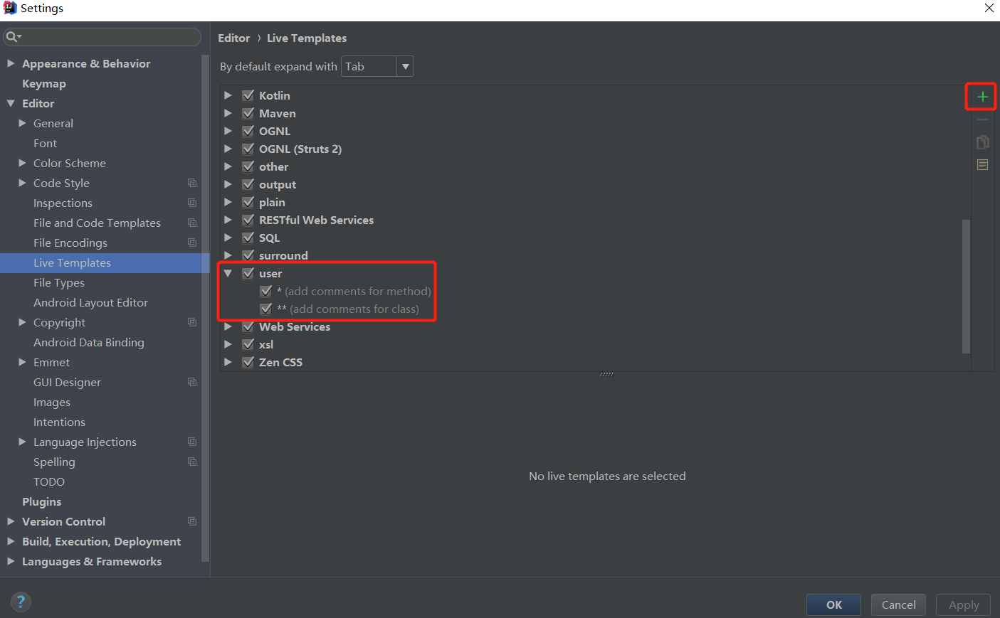
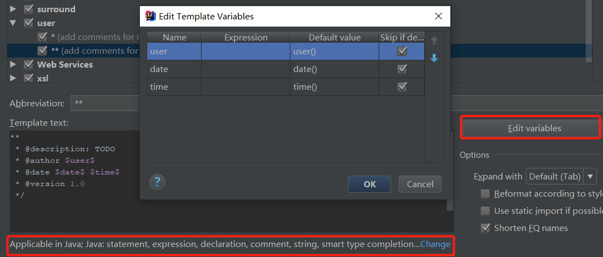
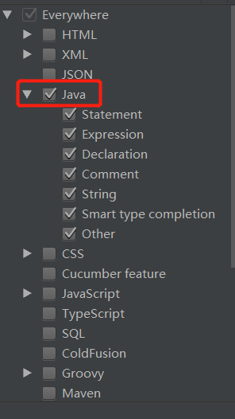
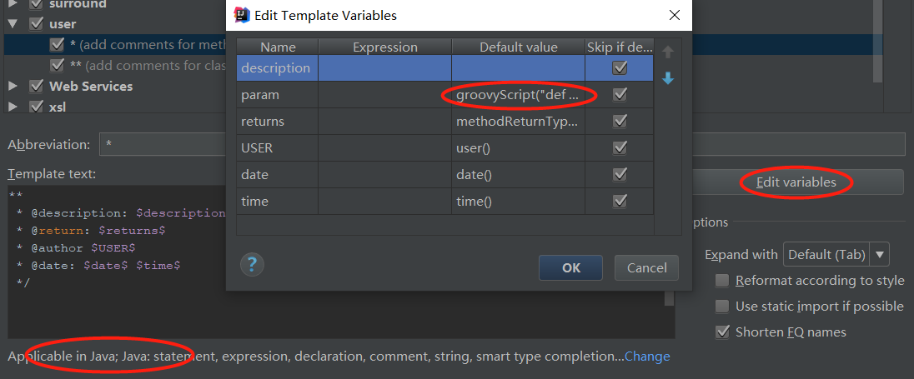

（未配置新建类时自动添加类注释）

#### 自定义模板配置

##### 一、配置类模板

File-->Settings-->Editor-->Live Templates



```java
**
 * @description: TODO
 * @author $user$
 * @date $date$ $time$
 * @version 1.0
 */
```

**记得还需要设置应用范围：**





##### 二、配置方法模板

```java
** 
 * @description: $description$TODO $param$
 * @return: $returns$
 * @author $USER$
 * @date: $date$ $time$
 */
```

```java
// param:
groovyScript("def result=''; def stop=false; def params=\"${_1}\".replaceAll('[\\\\[|\\\\]|\\\\s]', '').split(',').toList(); if (params.size()==1 && (params[0]==null || params[0]=='null' || params[0]=='')) { stop=true; }; if(!stop) { for(i=0; i < params.size(); i++) {result +=((i==0) ? '\\r\\n' : '') + ((i < params.size() - 1) ? ' * @param: ' + params[i] + '\\r\\n' : ' * @param: ' + params[i] + '')}; }; return result;", methodParameters())
```



